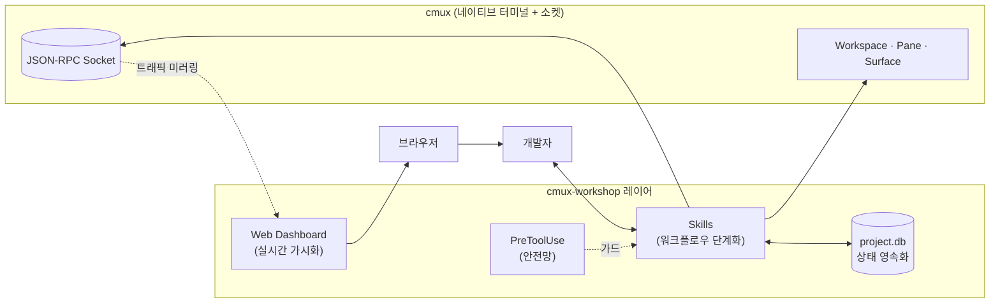
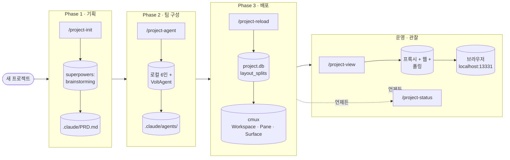
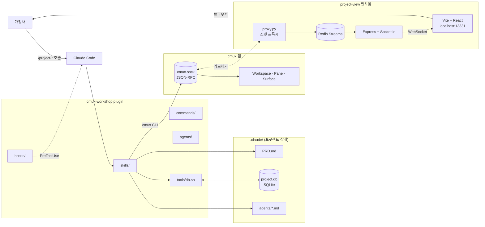
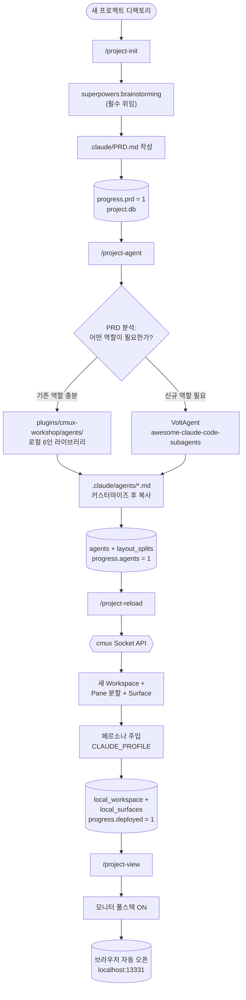
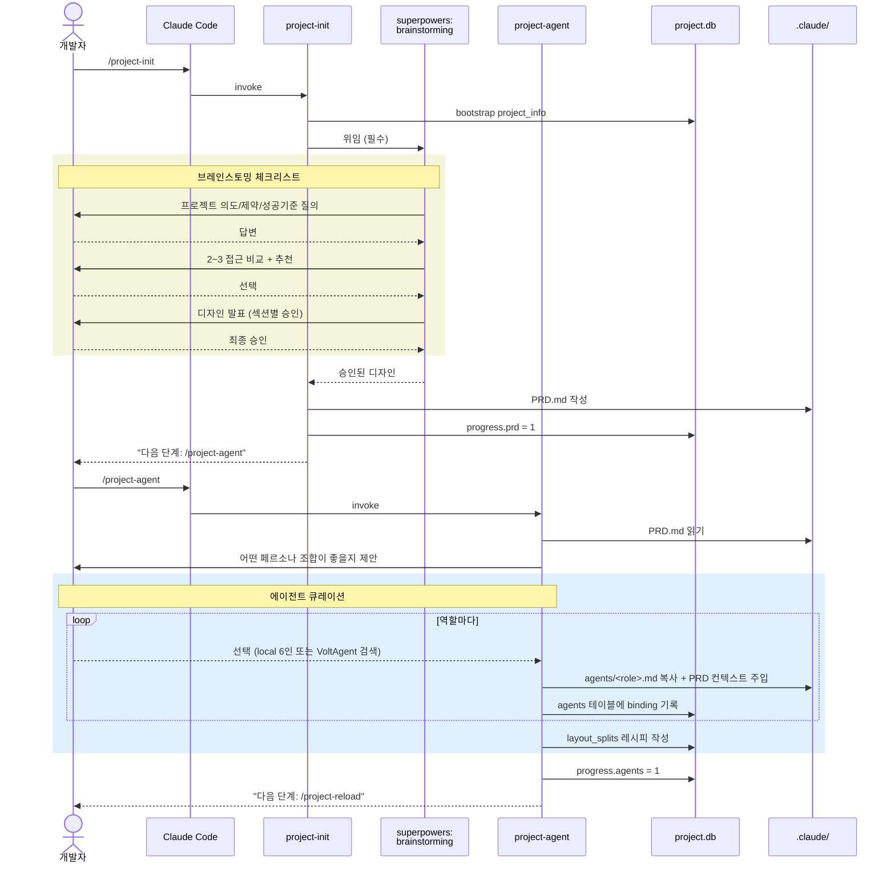
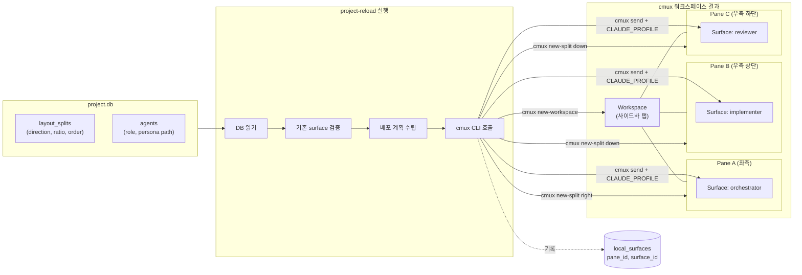
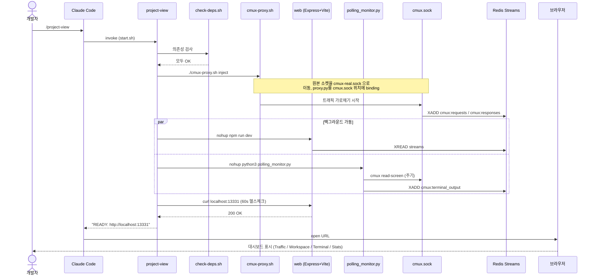
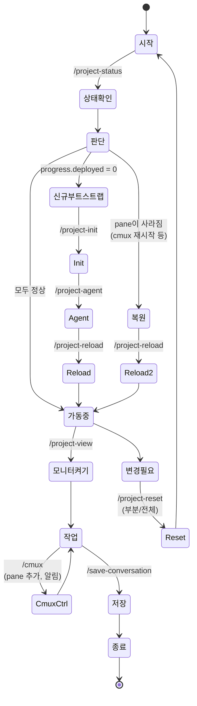
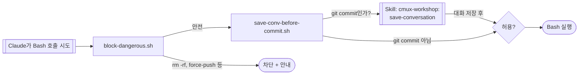
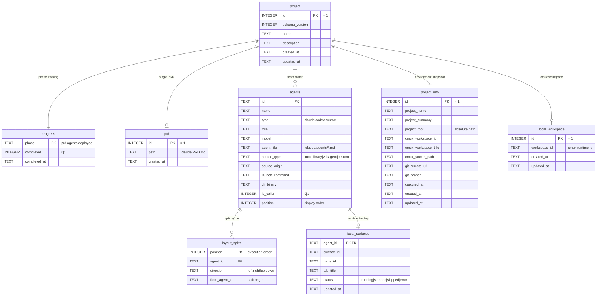

# cmux-workshop

> cmux의 터미널 토대 위에 **에이전트 오케스트레이션 + 실시간 시각화**를 한 묶음으로 정렬한 Claude Code 플러그인.

코딩 에이전트가 한 명일 때는 보이지 않던 균열들이, 두세 명을 동시에 굴리는 순간부터 또렷해진다. 이 프로젝트는 그 균열을 **새로운 도구로 덮는 대신**, 이미 잘 만들어진 cmux 터미널의 강점 위에 **얇은 한 겹**을 올려서 정렬해 본 시도다.

```
/project-init    →  /project-agent   →  /project-reload  →  /project-view
   기획 + PRD         에이전트 팀         cmux 배포           모니터 + 브라우저
```

---

## 출발점 — 에이전트 오케스트레이션의 작은 균열들

여러 에이전트를 하나의 프로젝트에 투입해 본 사람이라면 익숙할 풍경.

| 자주 마주치는 마찰 | 그게 왜 문제인가 |
|---|---|
| **컨텍스트가 휘발된다** | 세션이 끝나면 누가 어떤 결정을 왜 내렸는지의 흔적이 사라진다. 다음 날엔 같은 자리에서 다시 시작한다. |
| **상태가 머릿속에만 있다** | "PRD는 어디에", "에이전트 정의는 어느 폴더에", "어떤 pane에 누가 떠 있는지"가 사람의 기억에 의존한다. |
| **도구들이 따로 논다** | 브레인스토밍은 다른 스킬, 페르소나 정의는 또 다른 파일, 실제 실행은 터미널, 모니터링은 별도 CLI — 도구마다 멘탈 모델이 다르다. |
| **보이지 않는 곳에서 무슨 일이 일어나는지 알 수 없다** | 에이전트가 cmux 소켓에 무엇을 던지는지, 어떤 pane이 멈췄는지 확인하려면 직접 소켓을 dump 떠야 한다. |
| **재현되지 않는다** | 어제 잘 굴러가던 워크스페이스 레이아웃을 오늘 다시 만들 수가 없다. 손으로 다시 분할한다. |
| **안전망이 없다** | `git commit` 직전에 대화를 저장한다는 약속은 매번 잊혀지고, 위험한 명령은 실행 직전에야 후회한다. |

각 마찰을 푸는 도구는 이미 시장에 충분하다. 진짜 문제는 **그 도구들이 한 워크플로우 안에서 자연스럽게 이어지지 않는다**는 데 있다.

---

## 우리가 택한 경로

**새 터미널을 만들지 않는다.** cmux는 이미 코딩 에이전트가 동작할 네이티브 환경 — vertical tabs, split panes, 임베디드 브라우저, JSON-RPC 소켓, 알림 — 을 빠짐없이 갖추고 있다. cmux-workshop은 이 토대 위에 **얇은 일관성 레이어**를 얹는다.



레이어가 하는 일은 다섯 가지뿐이다.

1. **단계화** — 흐릿한 "에이전트 셋업"을 `init → agent → reload → view`라는 4단의 슬래시 명령으로 분해한다.
2. **영속화** — 모든 결정과 레이아웃을 `.claude/project.db` SQLite 한 곳에 모은다. 휘발성을 제거.
3. **위임** — 창의적 발산은 검증된 외부 스킬(`superpowers:brainstorming`)에 맡기고, 결과만 받아 PRD로 정리한다. 책임의 분리.
4. **가시화** — cmux 소켓 트래픽을 투명 프록시로 가로채 Redis Streams에 흘리고, 웹 대시보드로 즉시 드러낸다.
5. **재현** — 어제의 pane 레이아웃을 오늘 같은 명령으로 그대로 띄운다.

각각은 작은 결정이지만, 합쳐지면 "에이전트와 함께 일한다"는 경험이 한 단계 매끄러워진다.

---

## 왜 한 묶음의 플러그인인가

따로 떨어진 8개의 스킬을 사용자가 알아서 조합하게 두는 것과, 하나의 마켓플레이스 엔트리로 묶어 같은 네이밍·같은 DB·같은 모니터를 공유하게 하는 것은 다르다.

| 분산된 스킬 모음 | 단일 플러그인으로 통합 |
|---|---|
| 스킬마다 다른 namespace, 다른 DB 위치, 다른 환경변수 | `cmux-workshop:*` 네임스페이스 · `CMUX_WORKSHOP_DB_PATH` · 같은 PID/로그 prefix |
| 어떤 스킬을 먼저 부를지 매번 사용자가 결정 | `project-status` 한 줄로 "다음에 부를 스킬"이 안내됨 |
| 모니터·프록시·웹 서버를 직접 셋업 | `project-view` 한 번이면 의존성 검사 → 기동 → 브라우저 오픈까지 완료 |
| 안전 훅을 사용자가 직접 등록 | `hooks.json`이 활성화와 동시에 `PreToolUse` 가드 자동 적용 |
| 리포지토리 클론 후 추가 설정 다수 | 마켓플레이스 엔트리만 활성화 — vendor된 런타임이 그 자리에 있음 |

**플러그인이라는 단일 운반체** 덕분에, 사용자는 "워크플로우 전체"를 하나의 단위로 켜고 끌 수 있다. 일관성은 그 자체로 생산성이다.

---

## 효과 — 무엇이 얼마나 줄어드는가

같은 작업을 두 가지 방식으로 비교해 본다.

| 작업 | 일반적인 흐름 | cmux-workshop 흐름 |
|---|---|---|
| 새 프로젝트 부트스트랩 | 브레인스토밍 도구 → 메모 → PRD 수기 작성 → 에이전트 페르소나 직접 작성 → cmux pane 손으로 분할 → 각 pane에 페르소나 수동 주입 | `/project-init` → `/project-agent` → `/project-reload` (3개 슬래시) |
| 다음 날 재개 | "어디까지 했더라" → 흩어진 파일 뒤지기 → 작업 환경 재구성 | `/project-status` → 안내된 다음 스킬 호출 |
| cmux 재시작 후 복원 | 어제의 레이아웃을 손으로 재현 | `/project-reload` 한 번 |
| 트래픽 디버깅 | 소켓에 직접 붙어서 dump · 로그 파일 grep | `/project-view` → 브라우저에서 실시간 |
| 워크스페이스 정리 | 수동으로 pane 닫기 + 파일 삭제 | `/project-reset` (전체/부분 선택) |
| `git commit` 전 대화 보존 | 매번 의식적으로 챙겨야 함 | PreToolUse 훅이 자동 강제 |

**핵심은 "얼마나 빨라졌느냐"보다 "얼마나 덜 잊어버리느냐"다.** 머릿속에 들고 있어야 할 상태가 줄면, 그 자리를 실제 문제 해결에 쓸 수 있다.

---

## 사용자 친화성 — 도구가 사용자에게 묻는 것

좋은 도구는 사용자가 외워야 할 것을 줄인다. cmux-workshop이 의식적으로 따른 규칙들.

- **단일 진입점** — 가장 자주 쓰는 동작은 `/project-*` 슬래시 명령 하나로 시작한다. 모니터 종료도 `/project-view-stop`으로 같은 네이밍 안에 둔다.
- **트리거 자연어** — `/project-view` 외에도 "cmux 모니터 열어", "프로젝트 뷰", "open cmux monitor" 같은 자연어로도 호출된다. 명령을 외우지 않아도 의도가 통한다.
- **설치 없는 안내** — 의존성이 빠져 있으면 자동으로 설치하지 않고 `brew install ...` 한 줄을 출력한다. 사용자 머신에 모르는 사이 무언가 깔리는 일은 없다.
- **idempotent 호출** — 이미 켜져 있는 모니터를 다시 켜도 안전하다. 브라우저만 다시 열린다.
- **상태 안내 우선** — `project-status`가 "다음에 무엇을 할지"를 항상 알려준다. 사용자가 워크플로우 전체를 외울 필요가 없다.
- **출력의 일관성** — 모든 스크립트 로그에 `[cmux-workshop]` prefix. 브라우저 URL, PID 파일 위치, 종료 명령이 한 줄에 다 노출된다.

> "How it should work." — 사용자가 따로 배우지 않아도 도구가 자기 자신을 설명한다.

---

## 워크플로우 한눈에



---

## 시스템 아키텍처



플러그인은 **상태(.claude/)**, **cmux 앱(소켓)**, **모니터 런타임**의 세 영역을 다리 놓는다. 모든 skill은 같은 `tools/db.sh` 위에서 동작해 일관된 SQLite 스키마를 공유한다.

---

## 시나리오 1 — 새 프로젝트 부트스트랩

빈 디렉토리에서 시작해서 에이전트가 실제로 일을 시작할 수 있는 cmux 화면이 뜨기까지의 4단계.



**산출물**: PRD 1개, 에이전트 페르소나 N개, cmux pane 트리, 라이브 대시보드.

---

## 시나리오 2 — 에이전트 팀 브레인스토밍

`project-init` → `project-agent`의 내부 협업을 시퀀스로 본 모습. **사용자 결정**과 **AI 위임**이 명확히 구분된다.



**핵심 설계**: `project-init`은 **아이디어를 직접 묻지 않는다.** 모든 창의적 발산은 검증된 `superpowers:brainstorming` 스킬에 위임하고, 그 출력만 PRD 형태로 영속화한다. 도구 간 책임 분리가 명확하다.

---

## 시나리오 3 — cmux 터미널 pane 자동 배포

`project-reload`가 만드는 멀티 pane 화면. `.claude/project.db`의 `layout_splits` 레시피가 cmux Socket API를 통해 그대로 재현된다.



**복원 시나리오**도 동일하다. cmux를 껐다 켜서 모든 pane이 사라진 상태에서 `/project-reload`를 다시 부르면, 같은 레시피가 같은 모양으로 재구성된다. **재현성**이 핵심이다.

---

## 시나리오 4 — 실시간 관찰: project-view

배포가 끝난 뒤 "지금 에이전트들이 실제로 cmux 소켓에 무엇을 던지고 있는가?"를 보고 싶을 때.



**관찰 가능한 것**: 모든 JSON-RPC 호출, 워크스페이스 트리, 각 surface의 라이브 터미널 화면, 메서드별 통계. 디버깅과 데모 시연 모두에 직접 활용된다.

---

## 시나리오 5 — 일일 개발 라이프사이클

프로젝트가 이미 셋업된 다음 날, 일을 다시 이어가는 흐름.



**핵심 진입점은 항상 `/project-status`** — 어디서부터 다시 시작해야 할지 한 줄로 알려준다.

---

## 시나리오 6 — 안전장치: PreToolUse 훅

모든 Bash 도구 호출 직전에 걸리는 두 단계 가드.



훅은 `hooks.json`에 의해 cmux-workshop 플러그인이 활성화된 동안 자동으로 걸린다. 사용자가 별도로 설정할 것은 없다.

---

## 디렉토리 구조

```
cmux-workshop/
├── .claude-plugin/marketplace.json     # 마켓플레이스 진입
├── .claude/settings.json               # 로컬 플러그인 활성화
├── plugins/cmux-workshop/
│   ├── .claude-plugin/plugin.json      # 플러그인 메타
│   ├── agents/                         # 6개 페르소나 (orchestrator, implementer,
│   │                                   #   reviewer, architect, debugger, researcher)
│   ├── commands/                       # /project-* shims + code commands
│   ├── hooks/                          # PreToolUse 가드
│   │   ├── hooks.json
│   │   └── scripts/{block-dangerous,save-conv-before-commit}.sh
│   ├── tools/                          # 공용 SQLite 인프라 (db.sh + schema.sql)
│   │   ├── db.sh                       # init / query / json / scalar / exec / run / quote
│   │   ├── schema.sql                  # project / progress / prd / agents / layout_splits ...
│   │   ├── queries/                    # 재사용 SQL
│   │   └── scripts/project-info-{capture,show}.sh
│   └── skills/
│       ├── project-view/               # 모니터 원샷 런처 (vendor cmux-monitor)
│       │   ├── SKILL.md
│       │   ├── scripts/{start,check-deps,helpers}.sh
│       │   ├── runtime/                # cmux-monitor 풀스택을 vendor 복사
│       │   │   ├── proxy.py · monitor.py · polling_monitor.py · consumer.py
│       │   │   ├── cmux-proxy.sh · requirements.txt
│       │   │   └── web/{server, client, scripts}
│       │   └── references/{architecture,troubleshooting}.md
│       ├── cmux/                       # cmux 직접 제어 (split/notify/browser)
│       ├── save-conversation/          # 대화 마크다운 저장
│       ├── project-init/               # Phase 1 — PRD 부트스트랩
│       ├── project-agent/              # Phase 2 — 에이전트 팀 구성
│       ├── project-reload/             # Phase 3 — cmux 배포/복원
│       ├── project-status/             # 상태 확인 (어느 단계든 호출 가능)
│       └── project-reset/              # 정리 (부분/전체)
├── README.md / README-ko.md            # ← 본 문서
└── CLAUDE.md
```

## 상태 영속화 — `project.db` 스키마

휘발되던 머릿속 상태를 한 파일에 묶어 두는 것이 이 플러그인의 척추다. 모든 스킬은 동일한 `tools/db.sh` 위에서 같은 SQLite 스키마를 공유한다.

### 두 개의 영역(zone)

| Zone | 테이블 | 의도 |
|---|---|---|
| **Portable (git-safe)** | `project`, `progress`, `prd`, `agents`, `layout_splits`, `project_info`, `metadata` | 팀이 공유하는 "무엇을 만들 것인가 / 누구에게 맡길 것인가". 커밋 가능. |
| **Machine-local** | `local_workspace`, `local_surfaces`, `local_kv` | "지금 이 머신의 cmux pane이 어떤 ID를 갖는가". cmux 재시작마다 바뀜. |

분리 덕분에 **PRD와 에이전트 정의는 git으로 공유**하면서, 머신별로 다른 런타임 ID(workspace/pane/surface)는 별도로 관리된다.

### 테이블 한눈에

| 테이블 | 행 수 | 핵심 역할 |
|---|---|---|
| `project` | 단일 행 (`id=1`) | 프로젝트 표시 이름·설명·생성 시각 |
| `progress` | 정확히 3행 | `prd` / `agents` / `deployed` 단계의 완료 플래그 (0/1) |
| `prd` | 단일 행 | `.claude/PRD.md`로의 상대 경로 |
| `agents` | N | 에이전트 페르소나 binding (역할/모델/파일 위치/source) |
| `layout_splits` | N | cmux pane **재현 레시피** (실행 순서·분할 방향·기준 에이전트) |
| `project_info` | 단일 행 | 환경 스냅샷 (project_root, cmux_workspace_id, git remote/branch) |
| `metadata` | KV | 자유로운 확장 슬롯 |
| `local_workspace` | 단일 행 | 현재 머신의 cmux workspace ID |
| `local_surfaces` | N | 에이전트 ↔ surface/pane ID 매핑 + 상태(`running`/`stopped`/`skipped`/`error`) |
| `local_kv` | KV | 머신 로컬 자유 확장 슬롯 |

### 관계도(ERD)



### 스킬과 테이블의 책임 매트릭스

| 테이블 | `project-init` | `project-agent` | `project-reload` | `project-status` | `project-reset` |
|---|:-:|:-:|:-:|:-:|:-:|
| `project`, `project_info` | 생성 | — | — | 읽기 | 삭제(전체) |
| `progress.prd` | 1로 설정 | — | — | 읽기 | 0으로 |
| `prd` | 행 작성 | 읽기 | — | 읽기 | 행 삭제 |
| `agents` | — | 추가/갱신 | 읽기 | 읽기 | 행 삭제 |
| `layout_splits` | — | 작성 | 읽기 | 읽기 | 행 삭제 |
| `progress.agents` | — | 1로 설정 | 읽기 | 읽기 | 0으로 |
| `local_workspace` | — | — | upsert | 읽기 | 삭제 |
| `local_surfaces` | — | — | upsert | 읽기 + cmux 트리 대조 | 삭제 |
| `progress.deployed` | — | — | 1로 설정 | 읽기 | 0으로 |

각 스킬의 권한이 좁게 정의되어 있어, **어떤 스킬이 어떤 상태를 변경했는지가 항상 명확하다**.

### 디자인 결정 — 왜 이런 모양인가

- **WAL 비활성 (`PRAGMA journal_mode = DELETE`)** — 단일 `.db` 파일만 남도록 강제. `.db-wal` / `.db-shm` 부산물이 git에 끼어들지 않는다.
- **Foreign key + `ON DELETE CASCADE`** — `agents`에서 한 행을 지우면 그 에이전트의 `layout_splits`와 `local_surfaces`가 자동으로 함께 사라진다. `tools/db.sh`가 매 sqlite 연결마다 `PRAGMA foreign_keys=ON`을 주입하므로 부분 리셋이 안전하다.
- **단일행 테이블의 `CHECK (id = 1)`** — `project`, `prd`, `project_info`, `local_workspace`는 의미상 1개여야 한다는 제약을 스키마에 못박았다. 데이터 정합 오류가 컴파일 시점에 잡힌다.
- **시드 행 자동 삽입** — `progress`의 세 단계는 `INSERT OR IGNORE`로 미리 채워둬, 모든 `UPDATE`가 항상 hit하도록 보장.
- **Two-zone 분리의 실용 효과** — PRD와 에이전트 명세는 코드 리뷰 가능한 형태로 git에 들어가고, 휘발성 cmux runtime ID는 로컬에만 머문다. **재현성 + 머신 독립성**의 양립.

### `tools/db.sh` 한 줄 사용법

```bash
tools/db.sh migrate                         # 스키마 초기화 + pending migration 적용
tools/db.sh init                            # 스키마만 초기화 (idempotent, migrate 권장)
tools/db.sh exists                          # DB 파일 존재 여부
tools/db.sh path                            # 현재 DB 절대경로
tools/db.sh query "SELECT * FROM agents"    # 표 형식 (헤더 + |구분)
tools/db.sh json  "SELECT * FROM agents"    # JSON 배열
tools/db.sh scalar "SELECT completed FROM progress WHERE phase='prd'"
tools/db.sh exec  "UPDATE progress SET completed=1 WHERE phase='prd'"
tools/db.sh run   queries/reset-local.sql   # 파일로부터 실행
tools/db.sh quote "user's input"            # SQL 안전 이스케이프
```

`CMUX_WORKSHOP_DB_PATH`로 DB 경로를 오버라이드, `CMUX_WORKSHOP_DEBUG=1`로 sqlite3 호출 트레이스를 stderr에 출력한다.

---

## Skill 카탈로그

| Skill | 단계 | 한 줄 설명 |
|---|---|---|
| `project-init` | 1 | `superpowers:brainstorming`을 강제 호출, 승인된 설계를 PRD로 변환 |
| `project-agent` | 2 | 로컬 6인 + VoltAgent 라이브러리에서 페르소나 큐레이션 |
| `project-reload` | 3 | `project.db`의 layout_splits를 cmux pane으로 재현 |
| `project-view` | 운영 | 프록시 + 웹 + 폴링 풀스택을 한 번에, 브라우저 자동 오픈 |
| `project-status` | 부가 | 진행 단계 + 라이브 에이전트 트리 |
| `project-reset` | 부가 | 어느 단계로든 안전하게 되돌리기 |
| `cmux` | 부가 | cmux CLI 직접 제어 (pane/notify/browser) |
| `save-conversation` | 부가 | 대화를 `conv-logs/YYYYMM/DD/`에 마크다운으로 |

## Slash Commands

| Command | 용도 |
|---|---|
| `/project-init` | Phase 1 — 브레인스토밍 + PRD + `.claude/project.db` 부트스트랩 |
| `/project-agent` | Phase 2 — 에이전트 팀 구성 |
| `/project-reload` | Phase 3 — cmux pane 배포/복원 |
| `/project-reset` | pane/agent/PRD를 부분 또는 전체 정리 |
| `/project-status` | 진행 단계 + 라이브 에이전트 상태 확인 |
| `/project-view` | 프록시 + 웹 + 폴링 모니터 시작, 브라우저 오픈 |
| `/project-view-stop` | 모니터/프록시 스택 종료 |
| `/code-quality` | 9가지 차원으로 코드 품질 점수화 (병렬 에이전트) |
| `/code-explore` | 다중 에이전트 코드베이스 심층 분석 |
| `/merge-permissions` | 로컬 `.claude/settings.local.json`을 글로벌로 병합 |

## Claude Code에 설치하기

cmux-workshop은 **마켓플레이스 설치(권장)** 와 **로컬 클론** 두 가지 경로를 모두 지원한다. 두 방식 모두 설치 후 별도의 종속성(redis, node, python redis, 웹 패키지)은 [빠른 시작](#빠른-시작)의 사전 준비를 따라 갖춰야 한다 — 플러그인은 의존성을 자동 설치하지 않는다.

### 방법 1 — 마켓플레이스로 설치 (권장)

다른 프로젝트에서도 모든 skill·command·hook을 그대로 쓰려면 마켓플레이스 등록이 깔끔하다. Claude Code 안에서 다음을 차례로 실행한다.

```
/plugin marketplace add merong/cmux-workshop
/plugin install cmux-workshop@cmux-workshop
```

설치 후 Claude Code를 재시작하면 모든 슬래시 명령(`/project-view`, `/project-init`, `/project-agent`, `/project-reload`, `/project-status`, `/project-reset`, `/project-view-stop`, `/code-quality`, `/code-explore`, `/merge-permissions`)이 활성화된다.

마켓플레이스가 등록됐는지 확인:

```
/plugin
```

### 방법 2 — 로컬 클론 (기여·내부 수정용)

플러그인을 직접 수정하거나 메인 브랜치보다 앞선 변경을 시험하려면 로컬 클론 후 동봉된 `.claude/settings.json`이 활성화 역할을 그대로 맡게 한다.

```bash
git clone https://github.com/merong/cmux-workshop.git
cd cmux-workshop
```

저장소 루트의 `.claude/settings.json`은 다음과 같이 이미 설정되어 있다 — 별도 수정 없이 이 디렉토리에서 Claude Code를 띄우면 자동 활성화된다.

```json
{
  "enabledLocalPlugins": {
    "plugins/cmux-workshop/.claude-plugin": true
  }
}
```

다른 프로젝트에서 이 로컬 클론을 그대로 사용하고 싶다면, 그 프로젝트의 `.claude/settings.json`에 위 키를 동일하게 넣고 절대 경로로 `enabledLocalPlugins` 항목을 가리킨다.

### 활성화 확인

```
/plugin                                    # Claude Code 안에서
```

`cmux-workshop`이 enabled로 표시되면 끝. 셸에서 직접 보고 싶으면:

```bash
ls ~/.claude/plugins/marketplace/          # 마켓플레이스 등록 확인
ls ~/.claude/plugins/cache/                # 설치된 플러그인 캐시
```

### 업데이트 / 제거

```
/plugin update cmux-workshop@cmux-workshop
/plugin uninstall cmux-workshop@cmux-workshop
/plugin marketplace remove cmux-workshop
```

로컬 클론 모드는 `.claude/settings.json`의 해당 항목을 `false`로 바꾸거나 키를 지우면 비활성화된다.

## 빠른 시작

1. **사전 준비** (한 번만)

   ```bash
   # cmux 앱 (실행 중이어야 함) + Redis + Node18 + Python redis + 웹 의존성
   brew install redis node && brew services start redis
   pip3 install -r plugins/cmux-workshop/skills/project-view/runtime/requirements.txt
   ( cd plugins/cmux-workshop/skills/project-view/runtime/web && npm run install:all )
   ```

2. **플러그인 활성화** — [Claude Code에 설치하기](#claude-code에-설치하기) 섹션을 따라 마켓플레이스 또는 로컬 클론 방식으로 활성화.

3. **새 프로젝트라면**

   ```
   /project-init     ← 브레인스토밍 + PRD
   /project-agent    ← 에이전트 팀 구성
   /project-reload   ← cmux 배포
   /project-view     ← 모니터 + 브라우저
   ```

4. **재개라면**

   ```
   /project-status   ← 상태 확인
   /project-reload   ← 필요 시 복원
   /project-view     ← 모니터 재가동
   ```

## 운영 메모

- PID/로그: `/tmp/cmux-workshop-{web,polling}.{pid,log}`, `/tmp/cmux-proxy.log`
- 모니터 대시보드: `http://localhost:13331`
- 모니터 종료: `/project-view-stop`
- 환경 변수: `CMUX_WORKSHOP_DB_PATH` (DB 경로 오버라이드), `CMUX_WORKSHOP_DEBUG=1` (db.sh 트레이스)

## 디자인 원칙

1. **Self-contained vendor** — cmux-monitor 전체를 `runtime/` 아래로 복사. 외부 경로 의존 0.
2. **단일 네임스페이스** — 마켓플레이스/플러그인/환경변수/PID/로그 모두 `cmux-workshop`. 스킬 이름은 `project-*` 패밀리로 통일.
3. **CLI-first, 한 줄 우선** — 가장 자주 쓰는 동작은 슬래시 명령 하나로 끝낸다. 추가 스위치는 만들지 않는다(YAGNI).
4. **자동 설치 금지** — `check-deps.sh`는 진단·안내만. 사용자 머신을 임의로 건드리지 않는다.
5. **재현성** — 모든 워크플로우 상태는 `.claude/project.db` SQLite에 영속화. 재시작·복원·리셋이 같은 명령으로 동작.
6. **관찰 가능성** — `project-view`는 단순 데모가 아니라 실제 디버깅·검증 도구. 모든 cmux 트래픽이 즉시 가시화된다.
