# cmux-workshop

> A Claude Code plugin that aligns **agent orchestration + real-time visualization** on top of the cmux terminal foundation, in a single unified package.

The cracks you don't notice with a single coding agent become loud the moment you run two or three at once. Instead of papering over those cracks with yet another tool, this project lays a **thin layer** on top of cmux — a terminal that already does most of what we need — and tries to align everything we already had.

```
/project-init    →  /project-agent   →  /project-reload  →  /project-view
   plan + PRD        agent team         cmux deploy         monitor + browser
```

> Looking for the Korean original? See [README-ko.md](./README-ko.md).

---

## At a Glance — Screenshots & Demo

### Screenshots

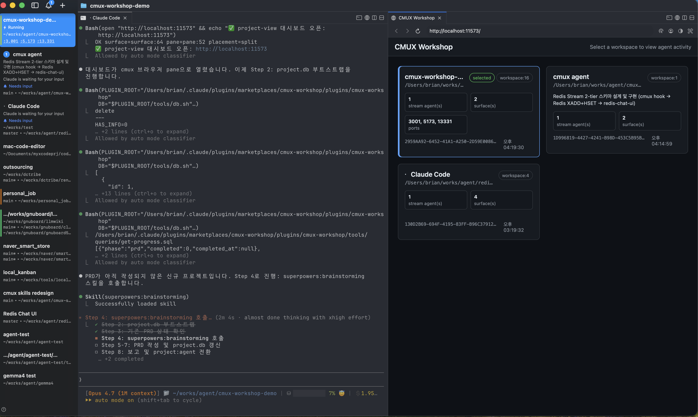
*Workspace selector view. The cmux sidebar and a Claude Code terminal (running `/project-init`) on the left; on the right, the CMUX Workshop dashboard immediately picks up the freshly bootstrapped project as a workspace card enriched from `project.db` (project_name · git branch · phase progress · listening ports).*

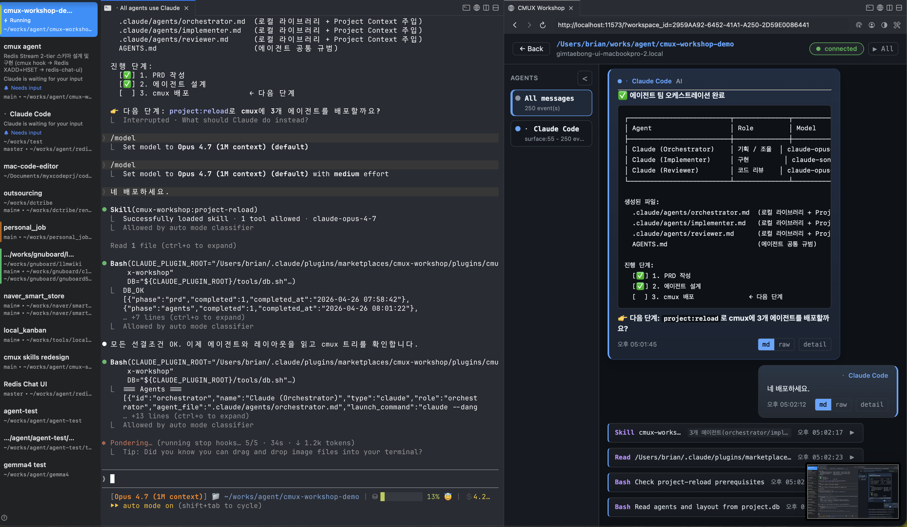
*Right after `/project-reload` deploys the personas (orchestrator · implementer · reviewer) into cmux panes. While Claude Code drives the work on the left, the redis-chat-ui dashboard on the right surfaces hook events (prompt-submit · tool call · stop) as a per-workspace chat timeline in real time.*

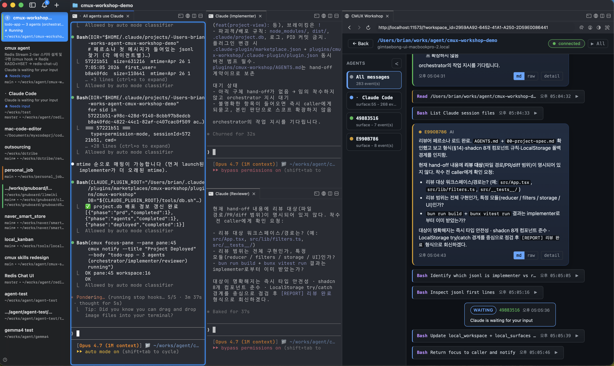
*Four cmux panes (Claude Code · Orchestrator · Implementer · Reviewer) running concurrently. The "All messages / per-agent" cards in the right sidebar let you filter the timeline down to a single surface, and each card shows the accumulated event count.*

### Demo videos

Recorded live demos live in this Google Drive folder:

→ [cmux-workshop demo videos (Google Drive)](https://drive.google.com/drive/folders/1ajLLNxfW3IxUBGWOwxxiopVDGCloj2u1?usp=drive_link)

Included clips:
- **`cmux-agent-create`** — the full path from `/project-init` → `/project-agent` → `/project-reload`, creating a new multi-agent workspace.
- **`cmux-agent-done`** — the deployed agent team finishing its work, with the results reflected in both the chat timeline and the cmux pane tree.

---

## Starting point — the small cracks in agent orchestration

If you have ever pointed several agents at a single project, this scenery should feel familiar.

| Friction you keep meeting | Why it actually hurts |
|---|---|
| **Context evaporates** | Once the session ends, the trail of "who decided what, and why" is gone. Tomorrow you start over from the same spot. |
| **State only lives in your head** | "Where is the PRD again?", "Which folder holds the agent definitions?", "Who is sitting in which pane?" — all kept alive by sheer human memory. |
| **The tools don't talk to each other** | Brainstorming uses one skill, persona definitions sit in another file, the actual run happens in the terminal, monitoring uses a separate CLI — every tool has a different mental model. |
| **You can't see what is happening behind the curtain** | To check what an agent threw at the cmux socket, or which pane has stalled, you end up dumping the socket by hand. |
| **It is not reproducible** | The workspace layout that worked yesterday cannot be brought back today. You re-split the panes by hand. |
| **There is no safety net** | The promise to "save the conversation just before `git commit`" gets forgotten every time, and dangerous commands only get regretted right after they execute. |

Each of those frictions has plenty of solutions on the market. The real problem is that **none of them flow naturally inside one workflow**.

---

## The path we chose

**We do not build a new terminal.** cmux already gives us the native environment a coding agent needs — vertical tabs, split panes, an embedded browser, a JSON-RPC socket, notifications. cmux-workshop drops a **thin consistency layer** on top of that foundation.

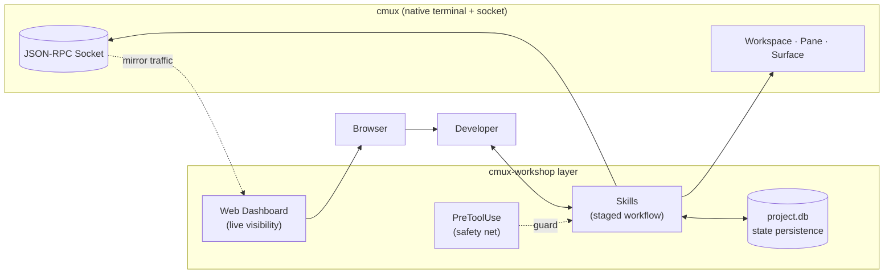

The layer does only five things.

1. **Stage** — the fuzzy notion of "agent setup" is broken into four slash commands: `init → agent → reload → view`.
2. **Persist** — every decision and layout lands in a single `.claude/project.db` SQLite file. Volatility removed.
3. **Delegate** — creative divergence is handed to a proven external skill (`superpowers:brainstorming`); we just take the result and shape it into a PRD. Clear separation of responsibility.
4. **Visualize** — cmux socket traffic is mirrored through a transparent proxy into Redis Streams and immediately surfaced in a web dashboard.
5. **Reproduce** — yesterday's pane layout can be brought back today with the exact same command.

Each piece is a small decision; together they make "working alongside agents" feel one notch smoother.

---

## Why a single bundled plugin

Letting a user assemble eight loose skills on their own is one thing. Wrapping them inside a single marketplace entry that shares the same naming scheme, the same DB, and the same monitor is something else entirely.

| Loose collection of skills | Bundled into one plugin |
|---|---|
| Each skill has its own namespace, DB location, and env vars | One `cmux-workshop:*` namespace · `CMUX_WORKSHOP_DB_PATH` · shared PID/log prefix |
| The user picks which skill to call first, every time | `project-status` reports "what to call next" in one line |
| Monitor / proxy / web server set up by hand | `/project-view` runs the dependency check, boots, and opens the browser in one shot |
| Safety hooks registered manually | `hooks.json` activates the `PreToolUse` guard the moment the plugin is enabled |
| Repository clone + lots of follow-up configuration | Just enable the marketplace entry — the vendored runtime is already in place |

Because the **plugin is the single carrier**, the user can switch the entire workflow on or off as one unit. Consistency itself is productivity.

---

## Effect — what actually shrinks

The same task in two flavors.

| Task | Common flow | cmux-workshop flow |
|---|---|---|
| Bootstrap a new project | brainstorm tool → notes → write PRD by hand → write personas by hand → split cmux panes manually → inject persona into each pane manually | `/project-init` → `/project-agent` → `/project-reload` (three slashes) |
| Resume the next day | "Where was I again?" → dig through scattered files → rebuild the working environment | `/project-status` → call the suggested next skill |
| Restore after cmux restart | Recreate yesterday's layout by hand | `/project-reload` once |
| Debug traffic | Attach to the socket and dump · grep log files | `/project-view` → live in the browser |
| Tear down a workspace | Close panes by hand + delete files | `/project-reset` (partial or full) |
| Save the conversation before `git commit` | You have to remember it every time | The PreToolUse hook enforces it automatically |

**The point isn't "how much faster" but "how much less you have to remember."** Less state in your head means more headroom for the actual problem.

---

## User-friendliness — what the tool asks of the user

A good tool shrinks the list of things you have to memorize. The rules cmux-workshop deliberately follows.

- **Single entry point** — every common action starts with one `/project-*` slash command. Even shutting down the monitor stays inside the same naming scheme: `/project-view-stop`.
- **Natural-language triggers** — alongside `/project-view`, phrases like "project view", "cmux chat view", or "see claude code activity" route to the same skill. You don't have to memorize the exact command.
- **Guidance instead of installation** — when a dependency is missing the plugin prints `brew install ...` instead of installing anything. Nothing gets put on your machine without you knowing.
- **Idempotent calls** — re-launching an already-running monitor is safe; the browser just gets re-opened.
- **State guidance first** — `project-status` always tells you "what to do next." You don't have to memorize the whole workflow.
- **Consistent output** — every script log carries the `[cmux-workshop]` prefix; the browser URL, PID file, and stop command all show up in the same line.

> "How it should work." — the tool explains itself without you having to learn it separately.

---

## The workflow in one diagram

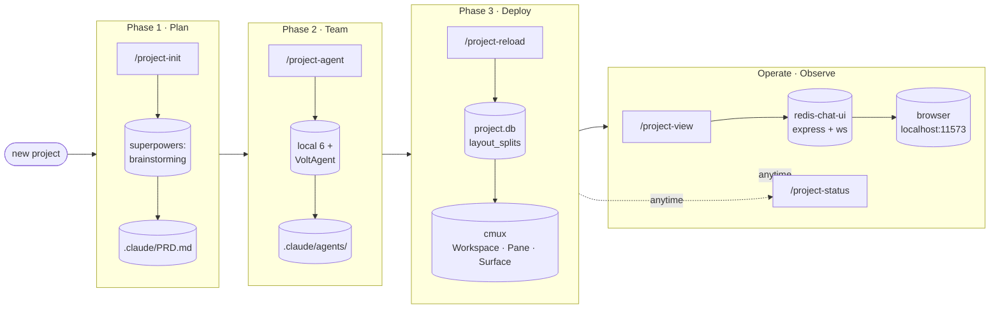

---

## System architecture

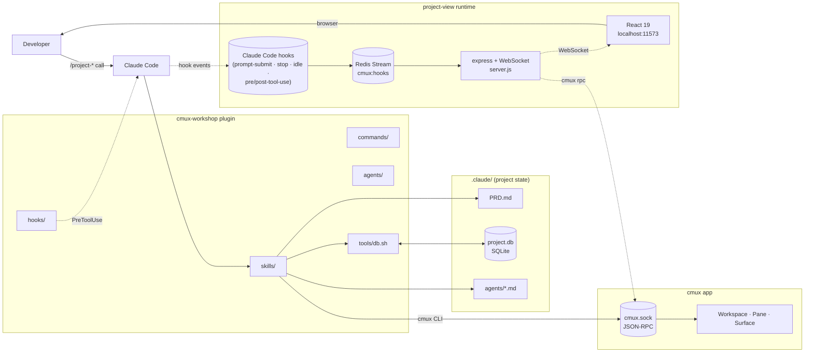

The plugin bridges three regions: **state (.claude/)**, the **cmux app (socket)**, and the **project-view runtime (redis-chat-ui)**. Every skill works on top of the same `tools/db.sh`, so they all share one consistent SQLite schema.

---

## Scenario 1 — Bootstrapping a new project

From an empty directory to a cmux screen where agents can actually start working — in four steps.

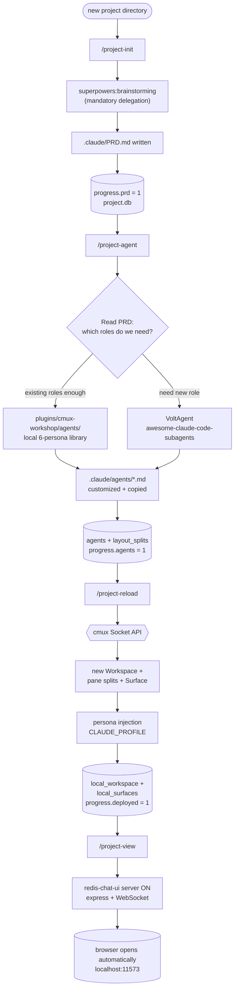

**Outputs**: one PRD, N agent personas, a cmux pane tree, a live dashboard.

---

## Scenario 2 — Brainstorming the agent team

The internal collaboration between `project-init` and `project-agent`, drawn as a sequence. **User decisions** and **AI delegation** are clearly separated.

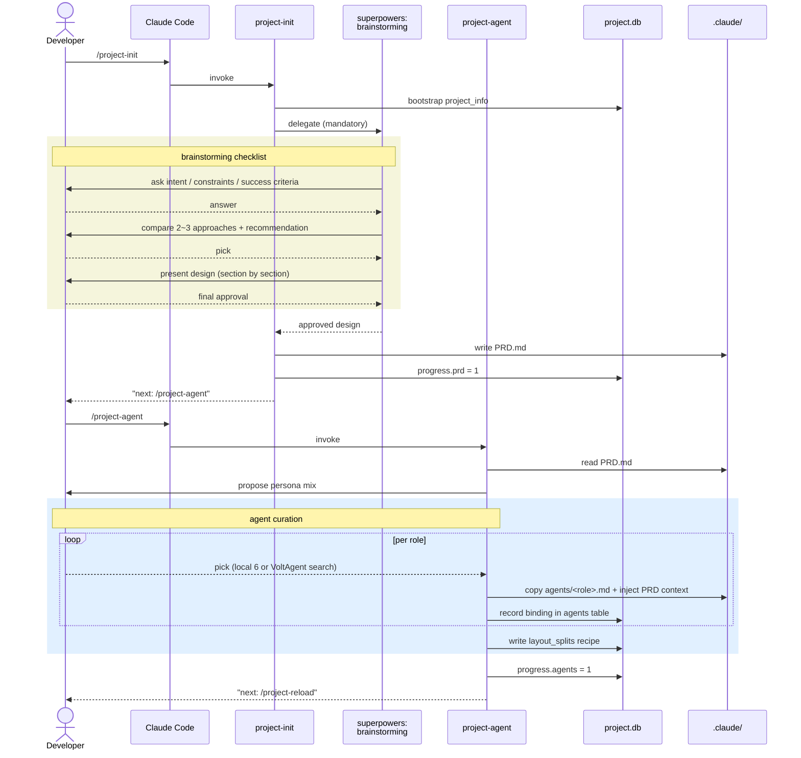

**Key design**: `project-init` **does not ask for ideas itself.** All creative divergence is delegated to the proven `superpowers:brainstorming` skill, and only its output is persisted as a PRD. Responsibility between tools stays cleanly separated.

---

## Scenario 3 — Auto-deploying cmux terminal panes

The multi-pane screen that `project-reload` creates. The `layout_splits` recipe in `.claude/project.db` is replayed verbatim through the cmux Socket API.

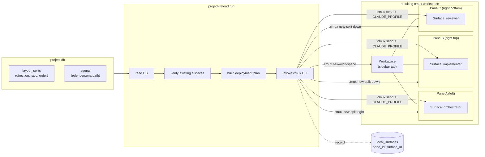

**Recovery is the same flow.** After cmux restarts and every pane is gone, calling `/project-reload` again replays the same recipe into the same shape. **Reproducibility** is the point.

---

## Scenario 4 — Live observation: project-view (redis-chat-ui)

After deployment, when you want a chat-style view of "what hook events (prompt-submit, tool calls, stop/idle) are flowing between the user and the agents right now."

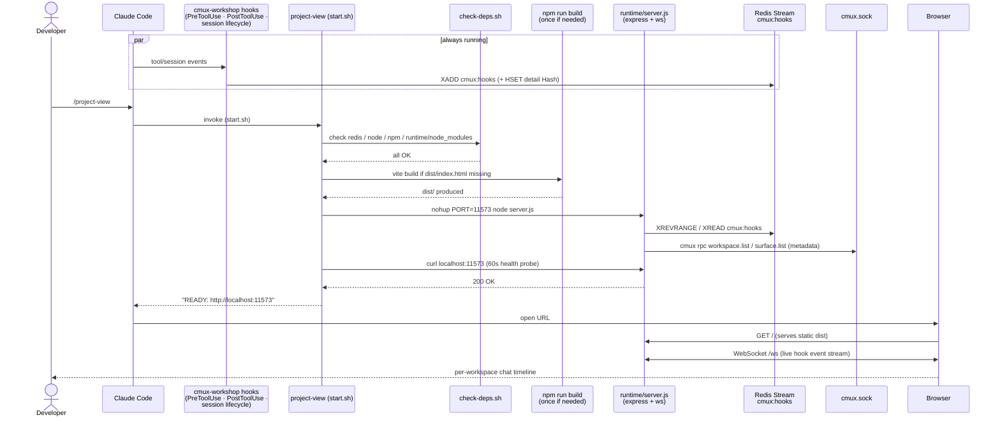

**What you can observe**: prompt-submit / pre-tool-use / post-tool-use / stop / idle events grouped by workspace, tool call input/response previews, and workspace titles + colors enriched via cmux RPC.

---

## Scenario 5 — Daily development lifecycle

The day after the project has already been set up — the flow for picking the work back up.

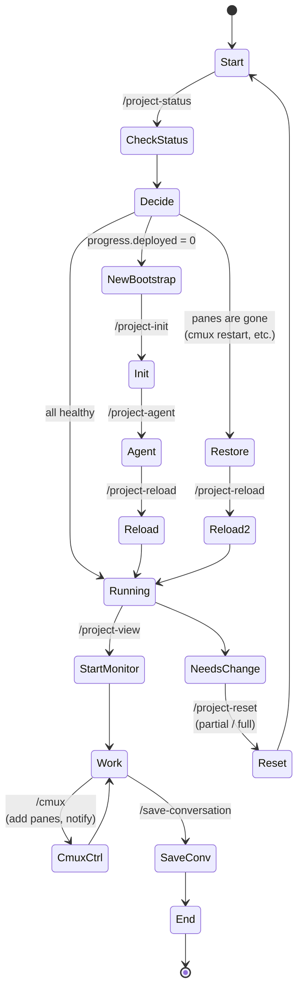

**The entry point is always `/project-status`** — one line tells you where to pick up.

---

## Scenario 6 — Safety net: PreToolUse hook

A two-stage guard that runs right before every Bash tool call.

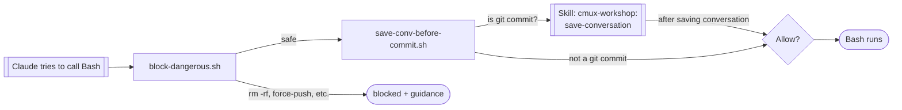

The hook is wired in via `hooks.json` and is active automatically while the cmux-workshop plugin is enabled. The user does not have to set anything up.

---

## Repository layout

```
cmux-workshop/
├── .claude-plugin/marketplace.json     # marketplace entry
├── .claude/settings.json               # local plugin enablement
├── plugins/cmux-workshop/
│   ├── .claude-plugin/plugin.json      # plugin metadata
│   ├── agents/                         # 6 personas (orchestrator, implementer,
│   │                                   #   reviewer, architect, debugger, researcher)
│   ├── commands/                       # /project-* shims + code commands
│   ├── hooks/                          # PreToolUse guards
│   │   ├── hooks.json
│   │   └── scripts/{block-dangerous,save-conv-before-commit}.sh
│   ├── tools/                          # shared SQLite plumbing (db.sh + schema.sql)
│   │   ├── db.sh                       # init / query / json / scalar / exec / run / quote
│   │   ├── schema.sql                  # project / progress / prd / agents / layout_splits ...
│   │   ├── queries/                    # reusable SQL
│   │   └── scripts/project-info-{capture,show}.sh
│   └── skills/
│       ├── project-view/               # one-shot launcher (vendored redis-chat-ui)
│       │   ├── SKILL.md
│       │   ├── scripts/{start,stop,check-deps,helpers}.sh
│       │   ├── runtime/                # vendored copy of the redis-chat-ui stack
│       │   │   ├── server.js           # express + WebSocket + redis stream consumer
│       │   │   ├── vite.config.js      # build-time only
│       │   │   ├── package.json · package-lock.json
│       │   │   ├── lib/parser.js       # stream-record normalization
│       │   │   └── client/             # React 19 (App.jsx, components, hooks, styles)
│       │   └── references/{architecture,troubleshooting}.md
│       ├── cmux/                       # direct cmux control (split/notify/browser)
│       ├── save-conversation/          # write conversation markdown
│       ├── project-init/               # Phase 1 — PRD bootstrap
│       ├── project-agent/              # Phase 2 — assemble agent team
│       ├── project-reload/             # Phase 3 — cmux deploy/restore
│       ├── project-status/             # status check (callable any time)
│       └── project-reset/              # cleanup (partial / full)
├── README.md / README-ko.md            # ← you are here
└── CLAUDE.md
```

## State persistence — the `project.db` schema

Folding the volatile state we used to keep in our heads into a single file is the spine of this plugin. Every skill works through the same `tools/db.sh` and shares the same SQLite schema.

### Two zones

| Zone | Tables | Intent |
|---|---|---|
| **Portable (git-safe)** | `project`, `progress`, `prd`, `agents`, `layout_splits`, `project_info`, `metadata` | "What are we building / who is responsible," shared by the team. Safe to commit. |
| **Machine-local** | `local_workspace`, `local_surfaces`, `local_kv` | "Which IDs do this machine's cmux panes hold right now." Changes on every cmux restart. |

The split lets you **share the PRD and agent definitions in git** while keeping per-machine runtime IDs (workspace/pane/surface) out of band.

### Tables at a glance

| Table | Rows | Core role |
|---|---|---|
| `project` | single (`id=1`) | display name · description · creation timestamp |
| `progress` | exactly 3 | completion flag (0/1) for the `prd` / `agents` / `deployed` phases |
| `prd` | single | relative path to `.claude/PRD.md` |
| `agents` | N | agent persona binding (role/model/file location/source) |
| `layout_splits` | N | cmux pane **replay recipe** (run order · split direction · base agent) |
| `project_info` | single | environment snapshot (project_root, cmux_workspace_id, git remote/branch) |
| `metadata` | KV | freeform extension slot |
| `local_workspace` | single | this machine's cmux workspace ID |
| `local_surfaces` | N | agent ↔ surface/pane ID mapping + status (`running`/`stopped`/`skipped`/`error`) |
| `local_kv` | KV | machine-local freeform extension slot |

### Relationships (ERD)

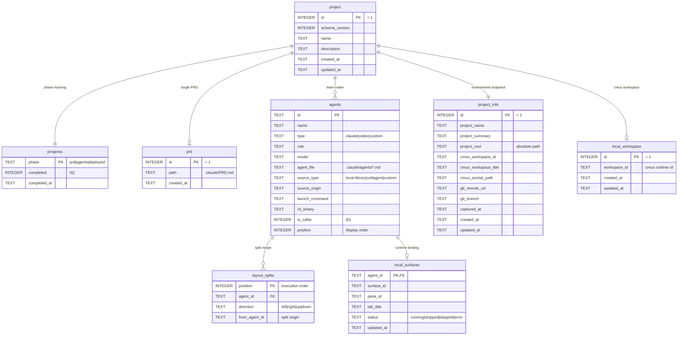

### Skill × table responsibility matrix

| Table | `project-init` | `project-agent` | `project-reload` | `project-status` | `project-reset` |
|---|:-:|:-:|:-:|:-:|:-:|
| `project`, `project_info` | create | — | — | read | drop (full) |
| `progress.prd` | set 1 | — | — | read | set 0 |
| `prd` | write row | read | — | read | delete row |
| `agents` | — | upsert | read | read | delete rows |
| `layout_splits` | — | write | read | read | delete rows |
| `progress.agents` | — | set 1 | read | read | set 0 |
| `local_workspace` | — | — | upsert | read | delete |
| `local_surfaces` | — | — | upsert | read + reconcile vs cmux tree | delete |
| `progress.deployed` | — | — | set 1 | read | set 0 |

Each skill's permissions are kept narrow, so **it is always clear which skill changed which piece of state**.

### Design choices — why it looks like this

- **WAL disabled (`PRAGMA journal_mode = DELETE`)** — forces a single `.db` file. The `.db-wal` / `.db-shm` byproducts never sneak into git.
- **Foreign keys + `ON DELETE CASCADE`** — deleting a row in `agents` automatically removes its `layout_splits` and `local_surfaces`. `tools/db.sh` injects `PRAGMA foreign_keys=ON` on every sqlite connection, so partial resets stay safe.
- **`CHECK (id = 1)` on single-row tables** — `project`, `prd`, `project_info`, `local_workspace` are conceptually singletons. The constraint is encoded in the schema itself, so integrity bugs surface at compile time.
- **Pre-seeded rows** — the three `progress` phases are pre-inserted with `INSERT OR IGNORE`, so every subsequent `UPDATE` is guaranteed to hit a row.
- **Practical effect of the two-zone split** — PRD and agent specifications go into git in a code-reviewable form, while volatile cmux runtime IDs stay local. **Reproducibility + machine independence** at once.

### `tools/db.sh` cheatsheet

```bash
tools/db.sh migrate                         # initialize schema + apply pending migrations
tools/db.sh init                            # initialize schema only (idempotent; prefer migrate)
tools/db.sh exists                          # does the DB file exist
tools/db.sh path                            # absolute DB path
tools/db.sh query "SELECT * FROM agents"    # tabular (header + |-separated)
tools/db.sh json  "SELECT * FROM agents"    # JSON array
tools/db.sh scalar "SELECT completed FROM progress WHERE phase='prd'"
tools/db.sh exec  "UPDATE progress SET completed=1 WHERE phase='prd'"
tools/db.sh run   queries/reset-local.sql   # run from a file
tools/db.sh quote "user's input"            # SQL-safe escape
```

`CMUX_WORKSHOP_DB_PATH` overrides the DB path; `CMUX_WORKSHOP_DEBUG=1` sends an sqlite3 call trace to stderr.

---

## Skill catalog

| Skill | Phase | One-liner |
|---|---|---|
| `project-init` | 1 | invokes `superpowers:brainstorming`, turns the approved design into a PRD |
| `project-agent` | 2 | curates personas from the local 6-persona library + VoltAgent |
| `project-reload` | 3 | replays `project.db`'s layout_splits into cmux panes |
| `project-view` | ops | brings the proxy + web + polling stack up in one shot, opens the browser |
| `project-status` | aux | progress phases + live agent tree |
| `project-reset` | aux | safely roll back to any phase |
| `cmux` | aux | direct cmux CLI control (pane/notify/browser) |
| `save-conversation` | aux | dump the conversation as markdown under `conv-logs/YYYYMM/DD/` |

## Slash commands

| Command | Purpose |
|---|---|
| `/project-init` | Phase 1 — brainstorming + PRD + `.claude/project.db` bootstrap |
| `/project-agent` | Phase 2 — assemble the agent team |
| `/project-reload` | Phase 3 — cmux pane deploy / restore |
| `/project-reset` | clean up panes / agents / PRD partially or fully |
| `/project-status` | inspect progress phases + live agent state |
| `/project-view` | start the proxy + web + polling monitor and open the browser |
| `/project-view-stop` | stop the monitor / proxy stack |
| `/code-quality` | score code quality across 9 dimensions (parallel agents) |
| `/code-explore` | multi-agent deep dive into a codebase |
| `/merge-permissions` | merge local `.claude/settings.local.json` into the global one |

## Installing in Claude Code

cmux-workshop supports both **marketplace installation (recommended)** and **local clone**. Either way, the dependencies (redis, node, python redis, web packages) listed in [Quick start](#quick-start) must be in place — the plugin never installs them for you.

### Option 1 — Marketplace (recommended)

If you also want to use every skill / command / hook from other projects, the marketplace registration is cleanest. Run the following inside Claude Code, one after the other.

```
/plugin marketplace add merong/cmux-workshop
/plugin install cmux-workshop@cmux-workshop
```

After the install, restart Claude Code. Every slash command is then live (`/project-view`, `/project-init`, `/project-agent`, `/project-reload`, `/project-status`, `/project-reset`, `/project-view-stop`, `/code-quality`, `/code-explore`, `/merge-permissions`).

To check that the marketplace is registered:

```
/plugin
```

### Option 2 — Local clone (for contributing or in-place edits)

If you want to modify the plugin or test changes ahead of `main`, clone locally and let the bundled `.claude/settings.json` take care of enablement.

```bash
git clone https://github.com/merong/cmux-workshop.git
cd cmux-workshop
```

The repository's `.claude/settings.json` is already configured as below — no extra editing needed; just open Claude Code in this directory and the plugin auto-enables.

```json
{
  "enabledLocalPlugins": {
    "plugins/cmux-workshop/.claude-plugin": true
  }
}
```

If you want to use this local clone from another project, copy the same key into that project's `.claude/settings.json` and point `enabledLocalPlugins` at the absolute path.

### Verifying activation

```
/plugin                                    # inside Claude Code
```

You're done if `cmux-workshop` shows up as enabled. To inspect from a shell:

```bash
ls ~/.claude/plugins/marketplace/          # registered marketplaces
ls ~/.claude/plugins/cache/                # installed plugin cache
```

### Update / uninstall

```
/plugin update cmux-workshop@cmux-workshop
/plugin uninstall cmux-workshop@cmux-workshop
/plugin marketplace remove cmux-workshop
```

In local-clone mode, flip the corresponding key in `.claude/settings.json` to `false` (or remove it) to disable.

## Quick start

1. **One-time prep**

   ```bash
   # cmux app (must be running) + Redis + Node 18 + python redis + web deps
   brew install redis node && brew services start redis
   pip3 install -r plugins/cmux-workshop/skills/project-view/runtime/requirements.txt
   ( cd plugins/cmux-workshop/skills/project-view/runtime/web && npm run install:all )
   ```

2. **Enable the plugin** — follow [Installing in Claude Code](#installing-in-claude-code) using either the marketplace or the local-clone route.

3. **For a new project**

   ```
   /project-init     ← brainstorming + PRD
   /project-agent    ← assemble agent team
   /project-reload   ← cmux deploy
   /project-view     ← redis-chat-ui server + browser
   ```

4. **To resume**

   ```
   /project-status   ← check state
   /project-reload   ← restore if needed
   /project-view     ← bring project-view back up
   ```

## Operating notes

- PID/log: `/tmp/cmux-workshop-web.{pid,log}` (single `node server.js` process)
- Dashboard: `http://localhost:11573` (override with `CMUX_WORKSHOP_SERVER_PORT`)
- Stop: `/project-view-stop`
- Environment variables:
  - `CMUX_WORKSHOP_DB_PATH` (override DB path), `CMUX_WORKSHOP_DEBUG=1` (db.sh trace)
  - `CMUX_WORKSHOP_SERVER_PORT` (default 11573), `REDIS_URL` (default `redis://127.0.0.1:6379`), `STREAM_KEY` (default `cmux:hooks`)

## Design principles

1. **Self-contained vendor** — the entire `redis-chat-ui` stack is copied under `runtime/`. Zero dependency on external paths.
2. **Single namespace** — marketplace / plugin / env vars / PID / log all carry `cmux-workshop`. Skill names share the `project-*` family.
3. **CLI-first, one-line first** — the most common actions complete in a single slash command. We don't add extra switches (YAGNI).
4. **No automatic installation** — `check-deps.sh` only diagnoses and instructs. The user's machine is never modified silently.
5. **Reproducibility** — every workflow's state is persisted in `.claude/project.db` (SQLite). Restart, restore, and reset all work through the same commands.
6. **Observability** — `project-view` is a debugging and demo tool that surfaces Claude Code hook events (prompt-submit / pre/post-tool-use / stop / idle) as a per-workspace chat timeline.
